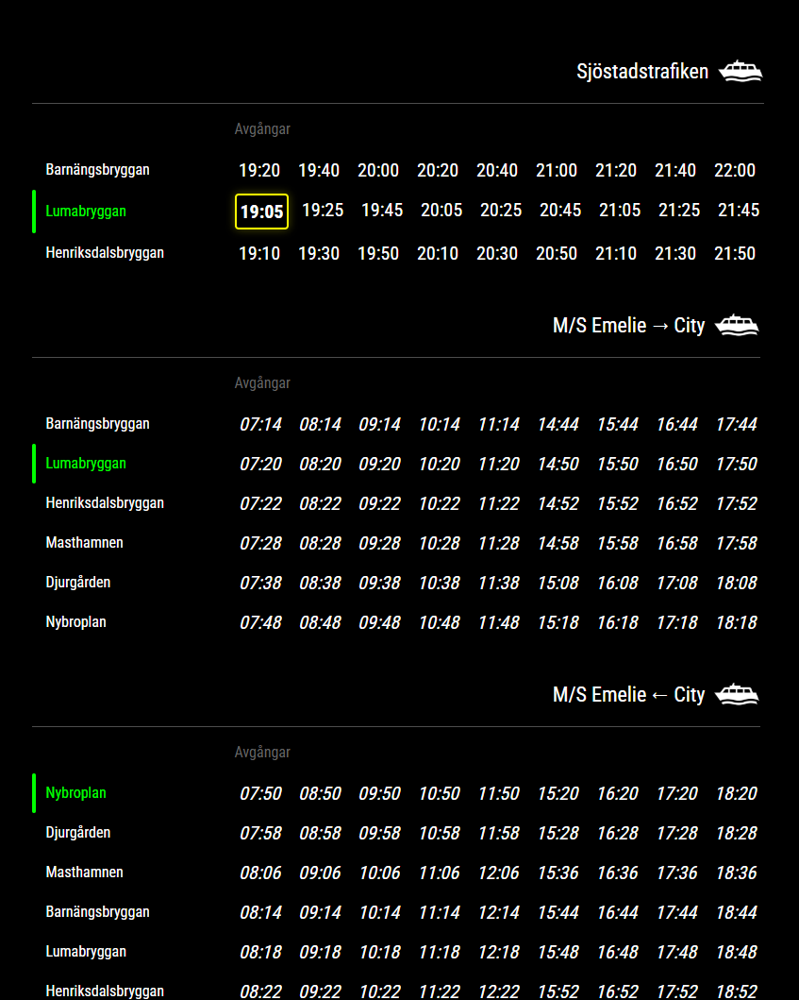

# Resseltrafiken Static Web Application



*[Svenska instruktioner finns längre ner - Swedish instructions available below](#swedish)*

A modern web application that displays timetables for the Sjöstadstrafiken and M/S Emelie boat lines in Stockholm.
Converted from the MagicMirror module MMM-Resseltrafiken into a standalone static web app.

## Version History

### Version 2.0.0 (2025-01-16)
- Converted to standalone static web app
- Improved error handling
- PWA (Progressive Web App) support
- Enhanced accessibility
- Responsive design for all screen sizes
- Automatic Swedish holiday handling

### Version 1.0.0 (2024-01-11)
- Original version based on MMM-Resseltrafiken
- Basic timetable display
- Swedish holiday support

## Features

- Real-time boat departure display
- Color-coded timing indicators:
  - Green border: Next departure (>10 minutes)
  - Yellow border: Imminent departure (<10 minutes)
  - Italic text: Next day departures
- Automatic Swedish holiday handling
- Updates every minute
- Responsive design
- Dark theme by default
- Installable as PWA
- Offline functionality
- Comprehensive error handling

## Installation

### Basic Installation
1. Download the latest version
2. Copy all files to your web server
3. Set correct file permissions
4. Open in browser

### Apache Server
```bash
# Copy files
cp -r resseltrafiken/ /var/www/html/

# Set permissions
chmod -R 755 /var/www/html/resseltrafiken/
chown -R www-data:www-data /var/www/html/resseltrafiken/
```

### Synology Web Station
1. Enable Web Station in Package Center
2. Create virtual host (optional)
3. Copy files to web folder
4. Set permissions via File Station

## Project Structure
```plaintext
resseltrafiken/
├── index.html              # Main page
├── css/
│   └── styles.css         # All styling
├── js/
│   ├── app.js            # Main logic
│   ├── timehandler.js    # Time handling
│   └── renderer.js       # UI rendering
├── data/
│   └── Ressel.json       # Timetable data
├── icons/
│   └── boat.png          # App icon
├── images/
│   └── screenshot.png    # Application screenshot
└── manifest.json         # PWA configuration
```

## Configuration

### Basic Settings
Edit the `config` object in `js/app.js`:
```javascript
const config = {
    updateInterval: 60000,           // Update interval (ms)
    showBothDirections: true,        // Show return trips
    highlightStop: "Lumabryggan",    // Stop to highlight
    cityReturnStop: "Nybroplan",     // Return stop
    maxVisibleDepartures: 9,         // Max visible departures
    dataPath: 'data/Ressel.json'     // Path to timetable data
};
```

### Timetable Data
- Located in `data/Ressel.json`
- Update this file when schedules change
- Validates data structure on load
- Includes metadata for version tracking

## Development

### Prerequisites
- Modern web browser
- Basic web server (Apache, Nginx, etc.)
- Text editor for modifications

### Local Development
1. Use any basic web server
2. Enable local file access for testing
3. Monitor browser console for errors

### Production Build
1. Minify CSS and JavaScript (optional)
2. Update version numbers
3. Test thoroughly
4. Deploy to web server

## Browser Support
- Chrome (latest)
- Firefox (latest)
- Safari (latest)
- Edge (latest)

## License
MIT License - see LICENSE file

## Developer
Christian Gillinger  
[GitHub](https://github.com/cgillinger)

---

<a name="swedish"></a>
# Resseltrafiken Statisk Webbapplikation

En modern webbapplikation som visar tidtabeller för Sjöstadstrafiken och M/S Emelie i Stockholm.
Konverterad från MagicMirror-modulen MMM-Resseltrafiken till en fristående statisk webbapp.

## Versionshistorik

### Version 2.0.0 (2025-01-16)
- Konverterad till fristående statisk webbapp
- Förbättrad felhantering
- Stöd för PWA (Progressive Web App)
- Förbättrad tillgänglighet
- Responsiv design för alla skärmstorlekar
- Automatisk hantering av svenska helgdagar

### Version 1.0.0 (2024-01-11)
- Ursprunglig version baserad på MMM-Resseltrafiken
- Grundläggande tidtabellsvisning
- Stöd för svenska helgdagar

## Funktioner

- Realtidsvisning av båtavgångar
- Färgkodade tidsindikatorer:
  - Grön ram: Nästa avgång (>10 minuter)
  - Gul ram: Snar avgång (<10 minuter)
  - Kursiv text: Morgondagens avgångar
- Automatisk hantering av svenska helgdagar
- Uppdateras varje minut
- Responsiv design
- Mörkt tema som standard
- Kan installeras som PWA
- Fungerar offline
- Omfattande felhantering

## Installation

### Grundinstallation
1. Ladda ner senaste versionen
2. Kopiera alla filer till din webbserver
3. Sätt korrekta filrättigheter
4. Öppna i webbläsaren

### Apache Server
```bash
# Kopiera filer
cp -r resseltrafiken/ /var/www/html/

# Sätt rättigheter
chmod -R 755 /var/www/html/resseltrafiken/
chown -R www-data:www-data /var/www/html/resseltrafiken/
```

### Synology Web Station
1. Aktivera Web Station i Package Center
2. Skapa virtuell host (valfritt)
3. Kopiera filer till web-mappen
4. Sätt rättigheter via File Station

## Projektstruktur
```plaintext
resseltrafiken/
├── index.html              # Huvudsida
├── css/
│   └── styles.css         # All styling
├── js/
│   ├── app.js            # Huvudlogik
│   ├── timehandler.js    # Tidshantering
│   └── renderer.js       # UI-rendering
├── data/
│   └── Ressel.json       # Tidtabellsdata
├── icons/
│   └── boat.png          # App-ikon
├── images/
│   └── screenshot.png    # Skärmdump av applikationen
└── manifest.json         # PWA-konfiguration
```

## Konfiguration

### Grundinställningar
Redigera `config`-objektet i `js/app.js`:
```javascript
const config = {
    updateInterval: 60000,           // Uppdateringsintervall (ms)
    showBothDirections: true,        // Visa returresor
    highlightStop: "Lumabryggan",    // Markera denna hållplats
    cityReturnStop: "Nybroplan",     // Returnhållplats
    maxVisibleDepartures: 9,         // Max antal synliga avgångar
    dataPath: 'data/Ressel.json'     // Sökväg till tidtabellsdata
};
```

### Tidtabellsdata
- Finns i `data/Ressel.json`
- Uppdatera denna fil när tidtabeller ändras
- Validerar datastruktur vid laddning
- Innehåller metadata för versionshantering

## Utveckling

### Förutsättningar
- Modern webbläsare
- Grundläggande webbserver (Apache, Nginx, etc.)
- Textredigerare för modifieringar

### Lokal utveckling
1. Använd valfri enkel webbserver
2. Aktivera lokal filåtkomst för testning
3. Övervaka webbläsarens konsol för fel

### För produktion
1. Minifiera CSS och JavaScript (valfritt)
2. Uppdatera versionsnummer
3. Testa noggrant
4. Publicera till webbserver

## Webbläsarstöd
- Chrome (senaste)
- Firefox (senaste)
- Safari (senaste)
- Edge (senaste)

## Licens
MIT License - se LICENSE-filen

## Utvecklare
Christian Gillinger  
[GitHub](https://github.com/cgillinger)