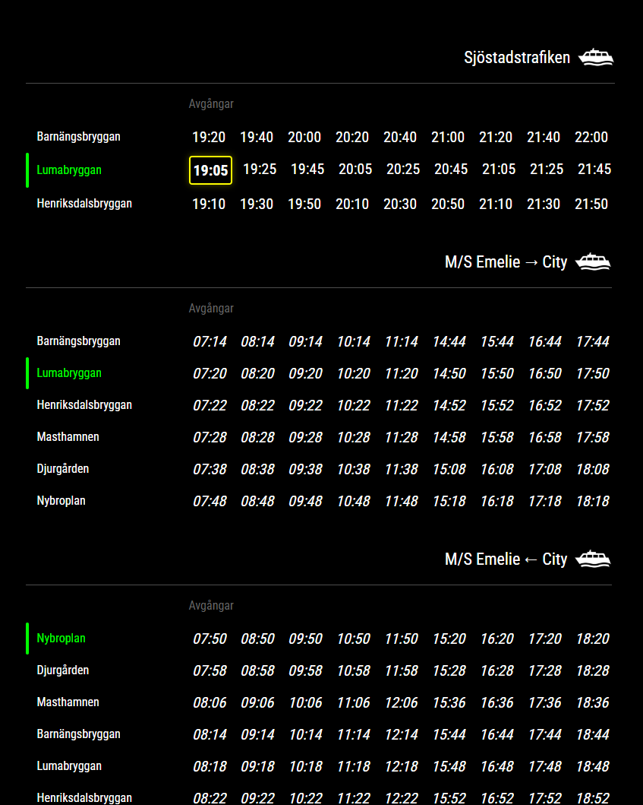
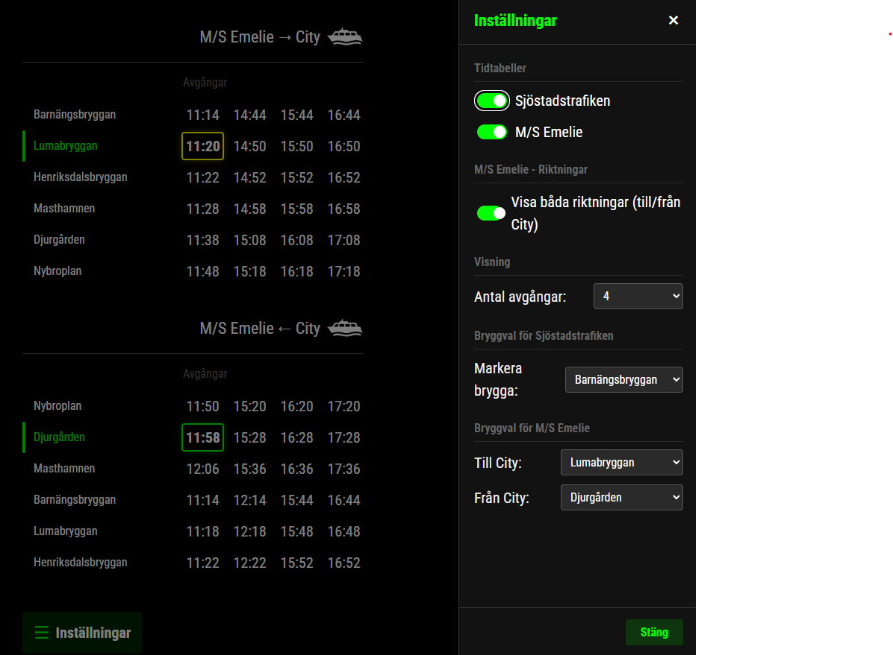

# Sjöstadsfärjetrafiken





En digital skyltlösning för att visa aktuella tidtabeller för båtlinjerna i Hammarby Sjöstad: Sjöstadstrafiken och M/S Emelie.

*[English instructions available below](#english)*

## Huvudfunktioner

- Realtidsvisning av båtavgångar
- Tydliga färgkodade indikatorer:
  - Grön ram: Nästa avgång (>10 minuter)
  - Gul ram: Snar avgång (<10 minuter)
  - Kursiv text: Morgondagens avgångar
- Hamburger-meny med inställningar för anpassning
- Automatisk anpassning för mobilskärmar
- Automatisk hantering av svenska helgdagar
- Uppdateras varje minut
- Fungerar på alla skärmstorlekar
- Mörkt tema som standard (perfekt för digitala skyltar)
- Kan installeras som app på mobil/surfplatta
- Fungerar även offline
- Omfattande felhantering

## Installation för digital skyltlösning

### Grundinstallation
1. Ladda ner senaste versionen
2. Extrahera filerna till valfri mapp
3. Starta genom att öppna index.html i en webbläsare

### För digital skyltning
1. Installera en webbläsare på din skärmenhet (Chrome, Firefox, Edge)
2. Konfigurera webbläsaren för kioskmodus/fullskärm
3. Ställ in automatisk start av webbläsaren vid uppstart
4. Peka webbläsaren mot index.html, eller använd en lokal webbserver

### Rekommenderade webblösningar för digital signage
- **Raspberry Pi**: Använd Chromium i kioskmodus
- **Android-surfplatta**: Installera som PWA (lägg till på hemskärmen)
- **Windows-dator**: Använd Chrome i kioskmodus + automatisk start
- **Smart TV med webbläsare**: Öppna sidan direkt i TV:ns webbläsare

## Inställningar och anpassning

### Användning av inställningspanelen
Klicka på "Inställningar" längst ner på sidan för att öppna inställningspanelen. Här kan du:

1. **Tidtabeller**: Visa/dölj Sjöstadstrafiken och M/S Emelie
2. **Riktningar**: Visa/dölj returresor för M/S Emelie (synligt när M/S Emelie är aktiverad)
3. **Visning**: Ändra antal avgångar som visas (3-15)
4. **Bryggor**: Välja vilka bryggor som ska markeras för respektive linje

Dina inställningar sparas automatiskt mellan besök i webbläsaren.

### Anpassning via URL-parametrar
Du kan anpassa visningen genom att lägga till parametrar i URL:en:

```
index.html?sjo=1&emelie=1&bothdir=1&highlight=Lumabryggan&maxdep=6
```

Tillgängliga parametrar:
- `sjo=1` eller `sjo=0`: Visa/dölj Sjöstadstrafiken
- `emelie=1` eller `emelie=0`: Visa/dölj M/S Emelie
- `bothdir=1` eller `bothdir=0`: Visa/dölj returresor för M/S Emelie
- `highlight=Bryggnamn`: Markera specifik brygga för Sjöstadstrafiken
- `cityhighlight=Bryggnamn`: Markera specifik brygga för M/S Emelie
- `returnstop=Bryggnamn`: Markera specifik brygga för returtrafik
- `maxdep=X`: Ange antal avgångar som ska visas (X = 3 till 15)

### Exempel på URL-konfigurationer

1. **Endast Sjöstadstrafiken**  
   `index.html?sjo=1&emelie=0`

2. **Endast M/S Emelie utan returresor**  
   `index.html?sjo=0&emelie=1&bothdir=0`

3. **Båda linjerna med Barnängsbryggan markerad och fler avgångar**  
   `index.html?sjo=1&emelie=1&highlight=Barnängsbryggan&maxdep=12`

4. **Mobiloptimerad visning**  
   `index.html?maxdep=5`

### Mobiloptimering
Appen är anpassad för att fungera bra på mindre skärmar:
- Automatiskt färre avgångar visas på mobila enheter (5 som standard)
- Kompakt inställningspanel som inte tar för mycket plats
- Responsiv design som anpassar sig till skärmens storlek

## Tidsperioder och tidtabeller

Applikationen stödjer automatiskt säsongstidtabeller:

- **Vintertidtabell**: Gäller 4 november 2024 - 21 april 2025
- **Vårtidtabell**: Gäller 22 april - 19 juni 2025

Systemet väljer automatiskt rätt tidtabell baserat på aktuellt datum.

## Felsökning

### Vanliga problem
1. **Ingen data visas**: Kontrollera internetanslutning eller om datum är utanför giltighetsperioden
2. **Fel tid visas**: Kontrollera enhetens systemtid och tidszon
3. **Långsamma uppdateringar**: Minska antalet synliga avgångar i inställningarna

### Tips
- För att testa att applikationen fungerar, öppna webbläsarens utvecklarverktyg och kontrollera konsolen för felmeddelanden
- Se till att filrättigheterna är korrekta om du använder en webbserver
- Aktivera debug-läget i konfigurationen för att se detaljerade loggmeddelanden i konsolen

## Utveckling

### Projektstruktur
```
sjostadsfärjetrafiken/
├── index.html              # Huvudsida
├── css/
│   └── styles.css          # Styling
├── js/
│   ├── app.js              # Huvudlogik
│   ├── timehandler.js      # Tidshantering
│   └── renderer.js         # UI-rendering
├── data/
│   ├── ressel-sjo.json     # Sjöstadstrafiken-data
│   ├── ressel-city.json    # M/S Emelie-data (vinter)
│   └── ressel-city-spring-2025.json # M/S Emelie-data (vår)
├── icons/
│   └── boat.png            # App-ikon
└── manifest.json           # PWA-konfiguration
```

## Licens
MIT License

## Utvecklare
Christian Gillinger  
[GitHub](https://github.com/cgillinger)

---

<a name="english"></a>
# Sjöstadsfärjetrafiken (Stockholm Harbor Ferry Timetables)

A digital signage solution for displaying current timetables for the boat lines in Hammarby Sjöstad, Stockholm: Sjöstadstrafiken and M/S Emelie.


## Key Features

- Real-time boat departure display
- Clear color-coded indicators:
  - Green border: Next departure (>10 minutes)
  - Yellow border: Imminent departure (<10 minutes)
  - Italic text: Next day departures
- Hamburger menu with settings for customization
- Automatic mobile screen adaptation
- Automatic Swedish holiday handling
- Updates every minute
- Works on all screen sizes
- Dark theme by default (perfect for digital signage)
- Can be installed as an app on mobile/tablet
- Works offline
- Comprehensive error handling

## Installation for Digital Signage

### Basic Installation
1. Download the latest version
2. Extract files to any folder
3. Start by opening index.html in a web browser

### For Digital Signage
1. Install a web browser on your display device (Chrome, Firefox, Edge)
2. Configure the browser for kiosk mode/fullscreen
3. Set up automatic browser launch at startup
4. Point the browser to index.html, or use a local web server

### Recommended Web Solutions for Digital Signage
- **Raspberry Pi**: Use Chromium in kiosk mode
- **Android tablet**: Install as PWA (add to home screen)
- **Windows PC**: Use Chrome in kiosk mode + auto-start
- **Smart TV with browser**: Open the page directly in the TV's browser

## Settings and Customization

### Using the Settings Panel
Click on "Settings" at the bottom of the page to open the settings panel. Here you can:

1. **Timetables**: Show/hide Sjöstadstrafiken and M/S Emelie
2. **Directions**: Show/hide return trips for M/S Emelie (visible when M/S Emelie is enabled)
3. **Display**: Change the number of departures shown (3-15)
4. **Stops**: Choose which stops to highlight for each line

Your settings are automatically saved between sessions in the browser.

### Customization via URL Parameters
You can customize the display by adding parameters to the URL:

```
index.html?sjo=1&emelie=1&bothdir=1&highlight=Lumabryggan&maxdep=6
```

Available parameters:
- `sjo=1` or `sjo=0`: Show/hide Sjöstadstrafiken
- `emelie=1` or `emelie=0`: Show/hide M/S Emelie
- `bothdir=1` or `bothdir=0`: Show/hide return trips for M/S Emelie
- `highlight=StopName`: Highlight specific stop for Sjöstadstrafiken
- `cityhighlight=StopName`: Highlight specific stop for M/S Emelie
- `returnstop=StopName`: Highlight specific stop for return traffic
- `maxdep=X`: Set number of departures to show (X = 3 to 15)

### Example URL Configurations

1. **Sjöstadstrafiken Only**  
   `index.html?sjo=1&emelie=0`

2. **M/S Emelie Only Without Return Trips**  
   `index.html?sjo=0&emelie=1&bothdir=0`

3. **Both Lines with Barnängsbryggan Highlighted and More Departures**  
   `index.html?sjo=1&emelie=1&highlight=Barnängsbryggan&maxdep=12`

4. **Mobile-Optimized Display**  
   `index.html?maxdep=5`

### Mobile Optimization
The app is designed to work well on smaller screens:
- Automatically displays fewer departures on mobile devices (5 by default)
- Compact settings panel that doesn't take up too much space
- Responsive design that adapts to screen size

## Time Periods and Timetables

The application supports automatic seasonal timetables:

- **Winter Timetable**: Valid November 4, 2024 - April 21, 2025
- **Spring Timetable**: Valid April 22 - June 19, 2025

The system automatically selects the correct timetable based on the current date.

## Troubleshooting

### Common Issues
1. **No data displayed**: Check internet connection or if date is outside validity period
2. **Wrong time displayed**: Check device system time and timezone
3. **Slow updates**: Reduce the number of visible departures in the settings

### Tips
- To test that the application is working, open the browser's developer tools and check the console for error messages
- Make sure file permissions are correct if using a web server
- Enable debug mode in the configuration to see detailed log messages in the console

## Development

### Project Structure
```
sjostadsfärjetrafiken/
├── index.html              # Main page
├── css/
│   └── styles.css          # Styling
├── js/
│   ├── app.js              # Main logic
│   ├── timehandler.js      # Time handling
│   └── renderer.js         # UI rendering
├── data/
│   ├── ressel-sjo.json     # Sjöstadstrafiken data
│   ├── ressel-city.json    # M/S Emelie data (winter)
│   └── ressel-city-spring-2025.json # M/S Emelie data (spring)
├── icons/
│   └── boat.png            # App icon
└── manifest.json           # PWA configuration
```

## License
MIT License

## Developer
Christian Gillinger  
[GitHub](https://github.com/cgillinger)